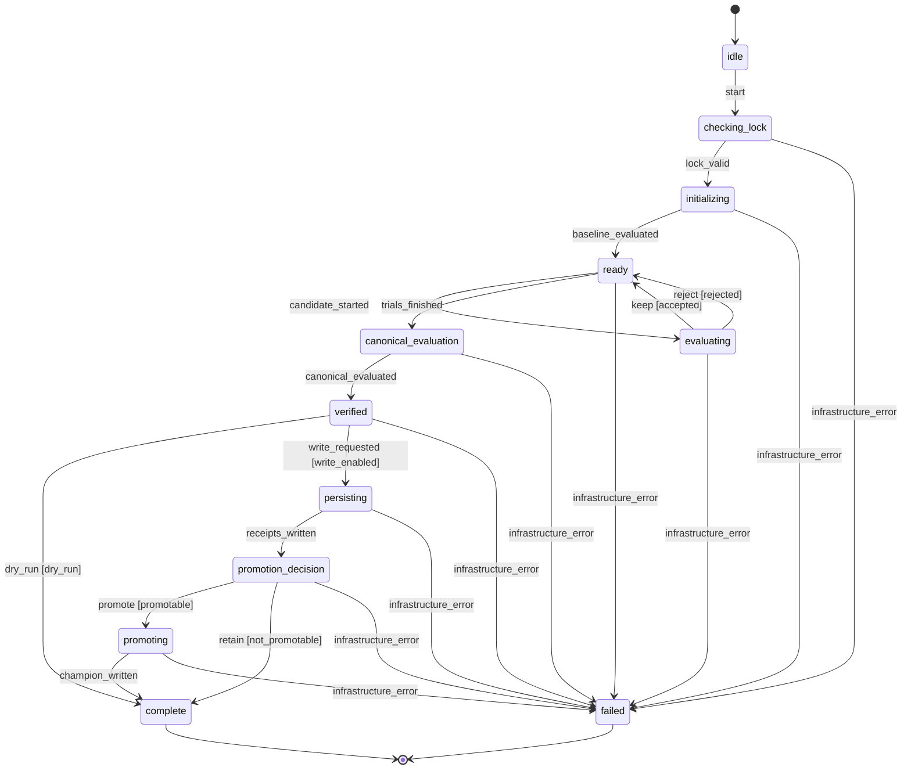

# Research controller lifecycle

Generated from `tools/statecharts/research.py`. Regenerate with
`python -m tools.statecharts.render`; CI checks for drift.

This is a flat, synchronous state machine, not SCXML or a hierarchical runtime.
The controller sends transitions before effects; rejected events cannot authorize
writes. KEEP/REJECT describe candidate gate outcomes only. Evaluator, lock, read,
and write errors propagate and mark the in-memory lifecycle failed.

The existing train/holdout gates and canonical promotion comparisons remain in
`autoresearch.py`. Tests drive those real decisions independently of this diagram.
The existing receipt schema is unchanged; lifecycle traces are in-memory evidence.

A dry run finishes after canonical evaluation without writing state. Writing is
still restricted to the scheduled state lane. The evaluator lock verifies evaluator
content and seeds; it is not a filesystem mutex. The machine does not provide
cross-process locking, transactional persistence, retries, or crash recovery.
Variant receipt and result append precede champion replacement, so a persistence
failure can leave partial writes. Reconcile actual receipts and champion before any
retry; do not infer completion from stdout or replay a write automatically.
Interruptions/termination can prevent an in-memory failure transition from being
recorded. Concurrent writers remain forbidden by repository ownership rules.

Export a source-bound contract and real dry-run trace to new derived output paths:
`python -m tools.statecharts.export --contract-out /tmp/research-contract.json
--trace-out /tmp/research-trace.json --iterations 3 --seed 42` (one command).
The exporter refuses existing outputs. Repo Defaults `statechart_contract.py`
can validate the contract, render its portable diagram, and audit this trace.
Native traces observe the machine, not independent application effects; the
controller tests separately assert policy selection and actual isolated writes.
Unvisited transitions in a dry run remain unverified by that trace.

